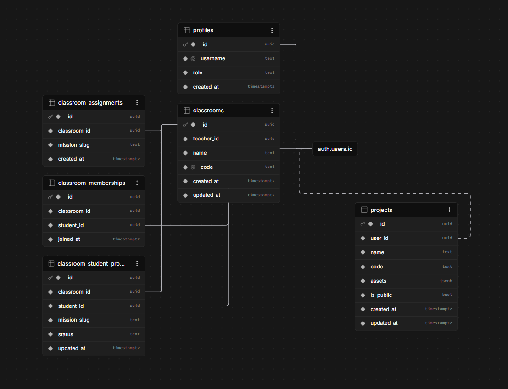
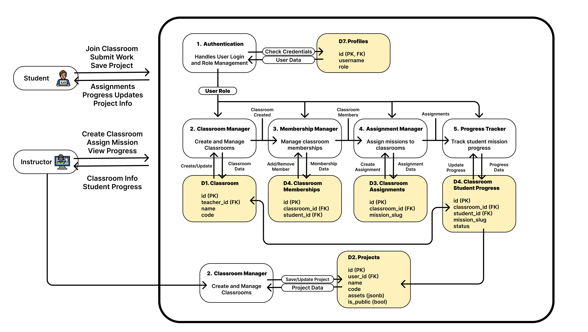
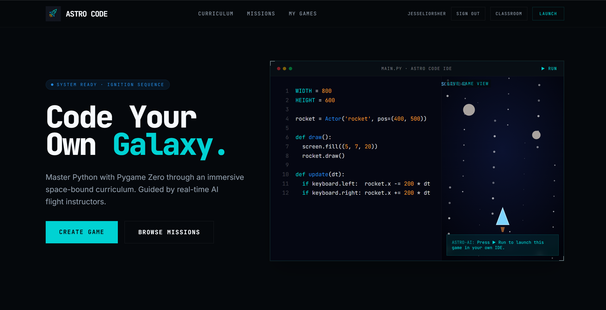
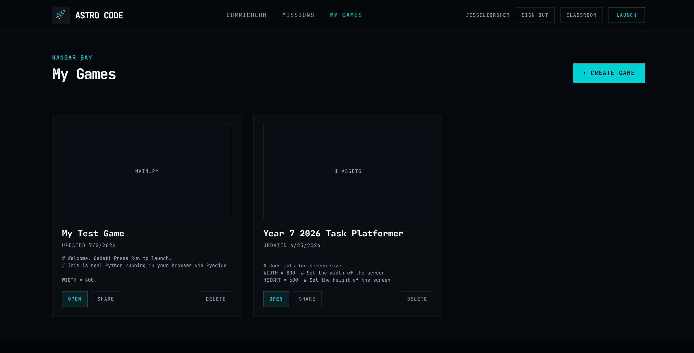
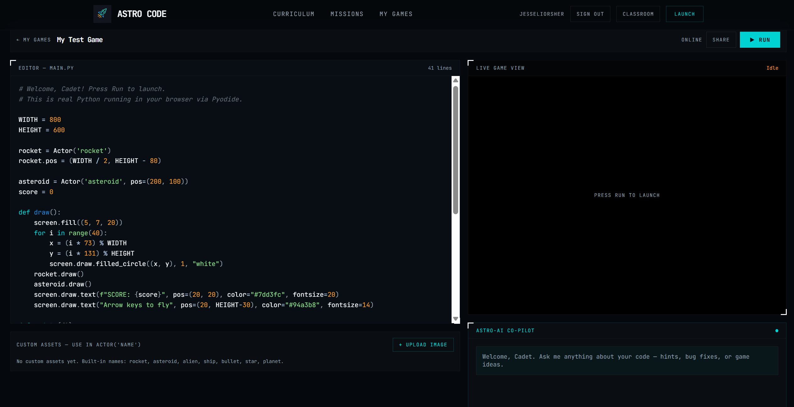
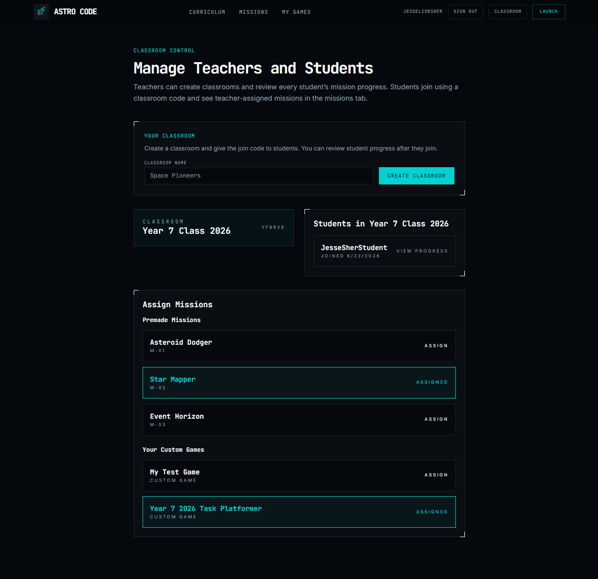
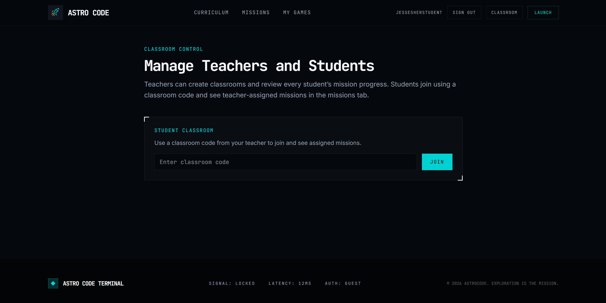
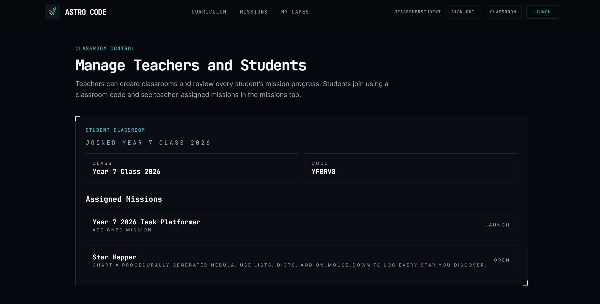

# Software Requirements Specification (SRS)

| Field | Value |
|-------|-------|
| **Project Name** | Astro Code |
| **Author** | Jesse Sher |
| **Class** | 10CTC |
| **Date** | Fri Jul 3, 2026 |
| **Version** | 1.0 |
| **GitHub Repository** | [https://github.com/astrogames06/astro-code-app](https://github.com/astrogames06/astro-code-app) |

---

# 1. Introduction

## 1.1 Purpose

This document is the software requirements specification for the Astro Code app. It outlines the functional and non-functional requirements and the system design.

The purpose of this document is to clearly define what the system will do, how it will behave and how the user interacts with it. It is intended to developers and testers involved in the design of the system.

This SRS describes the requirements for the application so that it can be implemented, tested, and maintained in a structured and consistent way.

---

## 1.2 Product Overview

Astro Code is an app that teaches people to create games in Python. The app is made for students and teachers with an in built classroom system to make teaching and learning an ease. It solves the problem for students since it allows them to have a simple application to build, run, test and share games, and for teachers who are then able to assign work and set up classrooms easily.

---

## 1.3 Scope

### In Scope

- User login and signup
- Classroom teacher/student system
- AI chat helper
- Saving user data to database

### Out of Scope

- Online chat
- Live sharing of code
- Payment systems
- Mobile app version

---

## 1.4 Definitions, Acronyms and Glossary

| Term | Definition |
|------|------------|
| SRS | Software Requirements Specification |
| MVP | Minimum Viable Product |
| CRUD | Create, Read, Update, Delete |
| Database | Organised storage of application data |
| Primary Key (PK) | Unique identifier for a record |
| Foreign Key (FK) | Links one table to another |

---

## 1.5 Technology Stack and Platform

- Frontend: React
- Backend: Bun
- Python Execution: Pyodide
- Database: Supabase
- Hosting: Vercel
- Version Control: GitHub
- AI Assistance: Lovable, GitHub Copilot, Cursor, ChatGPT

---

# 2. Overall Description

## 2.1 Product Perspective

Astro Code is a web-based programming platform. It depends on Supabase for storing user data and Vercel for web hosting. It also uses Pyodide to execute the python code.

## 2.2 User Characteristics

### User Type 1

- Description: Teachers wanting to set up an online Python classroom for students.
- Technical Skill: Intermediate.
- Needs: The app provides a classroom system where the teacher can create classrooms for each class and year and assign custom tasks.

### User Type 2

- Description: A student connecting to their teachers classroom.
- Technical Skill: Beginner
- Needs: The app provides a way for the student to connect to teachers classroom and start working on assigned tasks and share them with their teacher and fellow students.

---

## 2.3 Operating Environment

- Browser: Chrome, Edge, Safari, Firefox
- Devices: Laptop, Desktop
- Hosting: Vercel
- Database: Supabase
- Internet Required: Yes

---

## 2.4 Design and Implementation Constraints

- Time: Limited time to design and build the project.
- Budget: No budget available, so only free tools and services were used.
- Free tier limits: The system relies on free-tier services such as Supabase and Vercel, which impose usage and storage limits.
- Other constraints: The application uses specific technologies such as React, Bun, Supabase, and Vercel, which restrict certain implementation options.

---

## 2.5 Assumptions and Dependencies

- Users have a internet connection
- Users have a modern browser
- Users have basic computer skills
- Supabase & Vercel services are still available

---

# 3. Functional Requirements

## 3.1 Functional Requirements List

| ID | Requirement |
|----|-------------|
| FR-1 | The system shall allow users to create an account. |
| FR-2 | The system shall allow users to sign in to their account. |
| FR-3 | The system shall allow teachers to create a classroom. |
| FR-4 | The system shall allow students to join the teachers classroom via a classroom code. |
| FR-5 | The system shall allow teachers to create a new task. |
| FR-6 | The system shall allow teachers to assign a custom task to a specific class. |
| FR-7 | The system shall allow students to view their assigned tasks. |
| FR-8 | The system shall allow students to open the task and complete it. |
| FR-9 | The system shall allow teachers to view the students progress on the task. |
| FR-10 | The system shall allow students to share their project with fellow students. |

---

## 3.2 User Stories

- As a student, I want to join a classroom so that I can access my assigned tasks.
- As a student, I want to view my assigned tasks so that I am able to complete them.
- As a student, I want to create a new game so that I am able to share it with my teacher and fellow students.
- As a teacher, I want to create a new classroom so that I am able to add all my students to it.
- As a teacher, I want to create a new task so that I can assign it to the students to complete.

---

## 3.3 Context / Use Case Summary

1. Teacher creates a new task and assigns it to the class.
2. Student views the assigned task and begins working on it.
3. Student completes the task and submits/shares it with the teacher.
4. Teacher views the student’s progress on the task.
5. Teacher accesses the submitted project via a shared link and tests the game.

# 4. Non-Functional Requirements

| Quality | Requirement |
|---------|-------------|
| Performance | Pages load quickly, python code executes fast. |
| Usability & Accessibility | Simple interface for students and teachers. |
| Security & Privacy | Secure login and secure database. |
| Reliability | Data is saved consistently and retrieved correctly. |
| Maintainability | Clean code structure for easy updates. |

---

# 5. System Design

## 5.1 Data Dictionary

### Table: Teachers Classroom (classroom)

| Field | Type | Key | Rules / Notes |
|------|------|-----|---------------|
| id | uuid | PK | The unique identifier for each classroom. |
| teacher_id | uuid | FK | The unique identifier for the teacher that owns the classroom. |
| name | text | | The name that is given to each classroom. |
| code | text | | The code for each classroom that allows the students to join. |

---

### Table: Students Game Project (projects)

| Field | Type | Key | Rules / Notes |
|------|------|-----|---------------|
| id | uuid | PK | The unique identifier for each students game. |
| user_id | uuid | FK | The students unique identifier, who is the owner of the game. |
| name | text | | The name given to the students game. |
| code | text | | The Python code for the students project.  |
| assets | jsonb | | The images and assets for the students game.  |
| is_public | bool | | Determines if the students project is public meaning others can play and test it. |

### Table: classroom_assignments

| Field | Type | Key | Rules / Notes |
|------|------|-----|---------------|
| id | uuid | PK | The unique identifier for each classroom assignment. |
| classroom_id | uuid | FK | The classrooms unique identifier, which class the task is assigned to. |
| mission_slug | text | | The name the database uses to identify the mission. |

### Table: classroom_memberships

| Field | Type | Key | Rules / Notes |
|------|------|-----|---------------|
| id | uuid | PK | The unique identifier for each classroom membership. |
| classroom_id | uuid | FK | The classrooms unique identifier. |
| student_id | uuid | FK | The students that are in the classroom, their unique identifier. |

### Table: classroom_student_progress

| Field | Type | Key | Rules / Notes |
|------|------|-----|---------------|
| id | uuid | PK | The unique identifier for each classrooms student progress. |
| classroom_id | uuid | FK | The classrooms unique identifier. |
| student_id | uuid | FK | The students that are in the classroom, their unique identifier. |
| mission_slug | text | | The name the database uses to identify the mission. |
| status | text | | The students status on the assigned mission. |

### Table: profiles

| Field | Type | Key | Rules / Notes |
|------|------|-----|---------------|
| id | uuid | PK FK | The unique identifier for the users profile. |
| username | text | | The users unique username. |
| role | text | | Wether the user is a student or teacher. |

---

## 5.2 Entity Relationship Diagram (ERD)

Insert your ERD image.

---

## 5.3 Data Flow Diagram (DFD)

---

## 5.5 User Interface Design

### Home Page

Purpose:
Allows the user to access the Astro Code application and navigate to its main features.

Key Elements:

- Navigation Bar
    - Classroom Button
    - Launch Button
- Code Example
- Create Game Button
- Footer

---

### Launch Page

Purpose:

- To show all the users created games.

Key Elements:

- Navigation Bar
- Game Preview Container
- Create Game Button
- Open Game Button
- Delete Game Button
- Share Game Button
- Footer

---

### Integrated Development Environment Page

Purpose:

- For the user to be able to write code, upload assets and share their game.

Key Elements:

- Navigation Bar
- Code Editor Text Area
- Game Title
- Share Game Button
- Play Game Button
- Assets Uploader
    - Asset Upload Button
    - Preview Of Uploaded Assets
- Astro-AI chat
    - Input Textbox
    - Send Message Button
    - Chat Preview Box
- Footer

---

### Classroom Page for Teacher

Purpose:

- For the teacher to be able to see classrooms, students and assign tasks.

Key Elements:

- Navigation Bar
- Create Classroom Button
- Classroom Name Input Box
- List of Classrooms
    - Code to Join the Classroom
    - List of Students in the Classroom
    - List of assigned mission for the Classroom
- Footer

### Classroom Page for Student Before Joining

Purpose:

- To provide a place for the user to join a classroom via a code.

Key Elements:

- Navigation Bar
- Classroom Code Input box
- Classroom Join Button
- Footer

### Classroom Page for Student After Joining

Purpose:

- To show the classroom they are in with its join code and their assigned tasks.

Key Elements:

- Navigation Bar
- Classroom Name
- Classroom Join Code
- List of Assigned Tasks
    - Open Button for Assigned Task
- Footer

---

# 6. Quality and Evaluation

## 6.1 Acceptance Criteria

- FR-1: User account creation completed
- FR-2: User account login completed
- FR-3: Teacher classroom creation completed
- FR-4: Student classroom joining via code completed
- FR-5: Teacher assignments task completed
- FR-6: Students can view assigned tasks completed
- FR-7: User can create a new game completed
- FR-8: User can upload assets for games completed
- FR-9: User can share game completed
- FR-10: Teacher can view status of students task completed

---

## 6.2 Testing Approach

| Test Case | Expected Result | Actual Result | Pass |
|-----------|-----------------|---------------|------|
| FR-1: User account creation | New user account created | New user account was created | ✅ |
| FR-2: User account login | User logs into account | User was able to log into their account | ✅ |
| FR-3: Teacher classroom creation | New classroom gets created | New classroom was successfully created. | ✅ |
| FR-4: Student classroom joining via code | Student will be able to join class | Student successfully joined the classroom | ✅ |
| FR-5: Teacher assignments task | The task will get assigned to the students | The task was successfully assigned to the students | ✅ |
| FR-6: Students can view assigned tasks | Students will be able to view their tasks | The tasks successfully appeared to the students. | ✅ |
| FR-7: User can create a new game | User will be able to make a new game | The user successfully created a new game | ✅ |
| FR-8: User can upload assets for games | User will be able to upload custom assets to their game | The user's assets where successfully uploaded | ✅ |
| FR-9: User can share game | Users game will be shared via a link | The user's game was successfully shared and created a link | ✅ |
| FR-10: Teacher can view status of students task | The teacher will be able to see the status of the students task | The teacher successfully was able to view the students task status | ✅ |

---

## 6.3 Known Limitations and Future Work

### Known Limitations

- 3D Games
- Different programming languages
- Live Code Edit Sharing

### Future Improvements

- 3D Game functionality
- Able to programme in: Javascript, C++, C# etc.
- Live code sharing where teams able to edit the same code live.

---

## References

- GitHub Repository: [https://github.com/astrogames06/astro-code-app](https://github.com/astrogames06/astro-code-app)